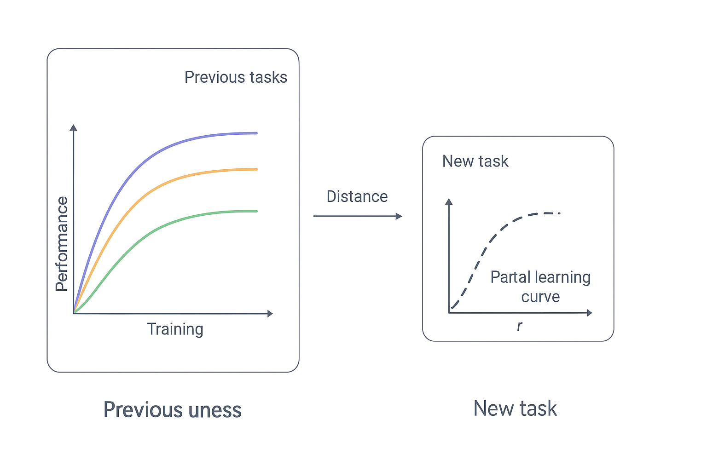

# Análisis del Documento: "Meta-Learning: A Survey"

**Autor:** Joaquin Vanschoren (Eindhoven University of Technology)  
**Tipo:** Survey/Revisión del Estado del Arte  
**Fecha:** Documento académico sobre meta-learning

---

## 📋 Resumen Ejecutivo

Este documento es una revisión exhaustiva del estado del arte en **meta-learning** (aprendizaje de aprendizaje). El autor presenta una taxonomía clara de las técnicas de meta-learning basada en el tipo de meta-datos que utilizan, desde los más generales hasta los más específicos de tareas.

### Definición Clave
**Meta-learning** es la ciencia de observar sistemáticamente cómo diferentes enfoques de machine learning se desempeñan en una amplia gama de tareas de aprendizaje, y luego aprender de esta experiencia (meta-datos) para aprender nuevas tareas mucho más rápido.

---

## 🏗️ Estructura del Documento

El documento está organizado en **4 secciones principales**:

### 1. **Introducción** (Sección 1)
- Contexto y motivación del meta-learning
- Desafíos principales
- Taxonomía basada en tipos de meta-datos

### 2. **Aprendizaje desde Evaluaciones de Modelos** (Sección 2)
- Técnicas que aprenden solo de evaluaciones de rendimiento
- No requieren información sobre las características de las tareas

### 3. **Aprendizaje desde Propiedades de Tareas** (Sección 3)
- Uso de meta-features para caracterizar tareas
- Construcción de meta-modelos

### 4. **Aprendizaje desde Modelos Previos** (Sección 4)
- Transfer learning
- Few-shot learning
- Meta-learning en redes neuronales

---

## 🔍 Análisis Detallado por Sección

### **Sección 2: Learning from Model Evaluations**

#### 2.1. Task-Independent Recommendations
**Concepto:** Recomendaciones de configuraciones que funcionan bien en general (en promedio en muchas tareas), sin necesidad de evaluaciones en la nueva tarea.

**Técnicas principales:**
- **Rankings globales:** Construir rankings por tareas (accuracy, AUC, tiempo) y combinarlos en un ranking global estable.
- **Portfolios de algoritmos:** Seleccionar un conjunto discreto de configuraciones probadas exhaustivamente en múltiples datasets.
- **Top-K configurations:** Tomar las K mejores del rankings global y ejecutarlas en la nueva tarea para obtener un buen punto de partida.

**Aplicación al proyecto:**
- ✅ Pueden implementarse rankings de algoritmos basados en rendimiento en datasets de OpenML
- ✅ Útil para warm-starting la búsqueda de algoritmos
- ✅ reduce el costo inicial: antes de personalizar, ya partes desde configuraciones estadísticamente robustas.

#### 2.2. Configuration Space Design
**Concepto:** En vez de buscar la mejor configuración en TODO el espacio,primero aprender qué regiones del espacio de configuración son más relevantes.

**Técnicas:**
- **Functional ANOVA:** Se estiman qué parte de la variabilidad del rendimiento se explica por cada hiperparámetro. Los que generan gran varianza, son importantes. Los que no aportan anda, se pueden fijar o ignorar.
- **Tunability:** En vez de empezar desde defaults manuales (C=1 en SVM) aprenden: Valores por defecto óptimo estimados a partir de miles de datasets. luego miden cuánta mejora puede obtenerse al tunear cada hiperparametro desde ese default. Esto deja claro: que hiper necesita tuning y cuáles puedes fijar sin remordimiento.
- **Default learning:** A veces el default depende del dataset: muchos features (un defutla para max_depth)o pocas instancias. Entonces aprenden funciones simples que ahustan el default según los meta-features del dataset. Luego una prueba estadística decide: si un hiperparámetro puede quedarse fijo o si es obligatorio tunearlo.

**Aplicación al proyecto:**
- ✅ Puede ayudar a reducir el espacio de búsqueda de hiperparámetros
- ✅ Identificar qué hiperparámetros son más importantes para diferentes tipos de datasets
- ✅ Puede generar defaults inteligentes para cada modelo en vez de usar valores arbitrarios
- ✅ Puede diseñar un espacio de configuración reducido que aceleera la optimización automática (Bayesian Optimization, SMAC, Optuna,...)

#### 2.3. Configuration Transfer
**Concepto:** Para recomendar buenas configuraciones en una nueva tarea, no basta con mirar rankings globales; necesitas saber qué tareas previas se parecen a la nueva.

**Cómo se hace:**
- Evalúa algunas configuraciones en la nueva tarea, obtienes $P_new$
- Comparas con evaluaciones anteriores $P_{i,j}$, encuentra treas similares
- Ajusta el meta-learner para usar configuraciones que funcionaron en tareas similares.

**Técnicas principales:**

1. **Relative Landmarks:**
   - Mide similitud de tareas por diferencias relativas de rendimiento entre configuraciones
   - Active Testing: Enfoque tipo torneo que selecciona competidores basándose en tareas similares

2. **Surrogate Models:**
   - Construir modelos sustitutos (surrogate models) para cada tarea previa
   - Usar Gaussian Processes (GPs) para modelar el rendimiento
   - Combinar modelos de tareas similares usando pesos

3. **Warm-Started Multi-task Learning:**
   - Aprender representaciones conjuntas de tareas
   - Usar redes neuronales para combinar modelos específicos de tareas

**Aplicación al proyecto:**
- ✅ Muy relevante: pueden implementarse surrogate models para predecir rendimiento
- ✅ Active testing puede ser útil para selección eficiente de algoritmos

#### 2.4. Learning Curves

**Concepto:**
Las curvas de aprendizaje reflejan cómo mejora el rendimiento de un modelo/configuración a medida que se agregan más datos de entrenamiento. En meta-learning, esta información se transfiere entre tareas para acelerar la búsqueda de buenas configuraciones en datasets nuevos.

**Aplicación:**

* Predecir el rendimiento final de una configuración en un nuevo dataset usando **curvas parciales** y experiencia previa en otras tareas.
* Detener el entrenamiento temprano si se predice que la configuración no será competitiva.
* Comparar formas de curvas parciales con curvas completas de tareas anteriores para seleccionar configuraciones prometedoras.
* Reducir el número de configuraciones a evaluar usando un **portfolio** de configuraciones históricamente efectivas y diversas.
* Integrar métricas de eficiencia, como tiempo de entrenamiento, para optimizar el trade-off entre rendimiento y coste computacional.

---

### **Sección 3: Learning from Task Properties**

**Concepto:** Usar propiedades de cada tarea (meta-features) para estimar similitud entre datasets y predecir qué configuraciones/modelos funcionarán mejor.

**Idea central:**
Cada tarea se representa como un vector de meta-features. Con ellos se pueden:

* Medir distancia/similitud entre tareas
* Transferir configuraciones exitosas (“portfolio”)
* Entrenar meta-modelos que predicen el rendimiento de configuraciones en nuevas tareas
* Reducir el costo de exploración evitando configuraciones malas desde el inicio

**Aplicación al proyecto:**

* 🧩 Permite mapear tareas nuevas al espacio de datasets históricos (OpenML, etc.)
* 🚀 Base para seleccionar configuraciones iniciales antes de entrenar
* 🔍 Precedente directo para integrar las curvas de aprendizaje parciales

---

#### **3.1. Meta-Features**

**Concepto:** Características numéricas que describen las propiedades estructurales, estadísticas y de complejidad de un dataset.

**Categorías principales:**

1. **Simples:**

   * Número de instancias
   * Número de atributos
   * Número de clases
   * Porcentaje de valores faltantes, outliers

2. **Estadísticas:**

   * Media, varianza, skewness, kurtosis
   * Covarianza, correlación
   * Sparsity, concentración

3. **Basadas en información:**

   * Entropía de clases
   * Información mutua
   * Coeficiente de incertidumbre

4. **Basadas en complejidad:**

   * Fisher discriminative ratio
   * Volume of overlap
   * Measures de separabilidad y variación del concepto

5. **Landmarking:**

   * Rendimiento de clasificadores simples (1NN, Árbol, Regresión lineal, Naive Bayes)
   * Relative landmarks para comparar tareas rápidamente

**Aplicación al proyecto:**

* 🛠️ Conectar los meta-features calculados con los del estándar en meta-learning
* 🔄 Normalizar y reducir dimensionalidad antes de comparar tareas
* 📦 Usar estas representaciones para buscar tareas similares y seleccionar configuraciones iniciales

---

#### 3.2. Learning Meta-Features

**Concepto:**
En vez de definir meta-features manualmente, se pueden **aprender representaciones automáticas** que capturen similitudes entre tareas usando meta-datos de rendimiento o combinaciones de configuraciones.

**Enfoques principales:**

1. **Meta-features binarios aprendidos (comparación de configuraciones):**

   * Se comparan pares de configuraciones ((\theta_a, \theta_b)) en tareas previas.
   * Se aprende si una configuración supera a otra.
   * Produce meta-features del tipo: “¿(\theta_a) vence a (\theta_b)?”.

2. **Representaciones aprendidas desde el rendimiento (P):**

   * Se aprende una función (f : P \times \Theta \rightarrow M') usando redes neuronales.
   * Captura patrones globales de comportamiento de configuraciones.

3. **Redes siamesas (si las tareas comparten el mismo input):**

   * Two networks comparten pesos y reciben dos tareas distintas.
   * Tareas similares se mapean cerca en el espacio latente.
   * Útiles para *warm-start* en optimización bayesiana y NAS.

**Aplicación al proyecto:**

* Permite extender los meta-features clásicos con representaciones aprendidas.
* Ideal cuando el número de tareas es grande y se quiere capturar relaciones complejas.
* Compatible con usar tus matrices (P) y configuraciones (\Theta) como entrada directa.

---

#### 3.3 Warm-Starting Optimization from Similar Tasks

**Concepto:** Los meta-features permiten estimar qué tareas son similares y usar ese conocimiento para inicializar algoritmos de optimización.

**Ideas centrales:**

- **Búsqueda genética y PSO**: Seleccionar las k tareas más similares midiendo distancia L1 entre sus vectores de meta-features. De cada una se toma la mejor configuración y se usa para inicializar la optimización. 
- **Optimización basada en modelos (SMBO):** Modelos como **SCoT** entrenan un surrogate que predice el ranking esperado de cada configuración, usando meta-features simples + PCA. Luego convierten esos rankings en probabilidades para hacer optimización bayesiana.
- **Redes neuroanles como modelo sustituto:** Algunos métodos usan **MLPs** modificados para apredner representaciones latentes de tareas y modelar similitudes. Como no modelan incertidumbre directamente, entrenan ensembles de MLPs.
- **Modelos más escalables:** Otros trabajos entrenan un único modelo pero solo con tareas similares, normalizando escalas para que la comparación sea consistente.
- **Métodos prácticos y escalable:** Ver **Feurer et al.(2014-2015--Auto-sklearn)** ordenan las tareas por similitud usando 46 meta-features y usan las mejores configuraciones de las tareas más parecidas como warm-start para Bayesian Optimization. Funcioan increíblemente bien en la práctica.
- **Filtrado colaborativo:** Se trata el problema como recomendación: tareas = usuarios, configuraciones=ítems, evaluaciones Pi,j = ratings. La matriz se factoriza para predecir configuraciones prometedoras.Necesita algunas evaluaciones iniciales (cold start), pero puede mitigarse combinando meta-features y diseño óptimo de experimentos

---

#### 3.4. Meta-Models

**Concepto:** Modelos que aprenden la relación entre meta-features y rendimiento de configuraciones.

**Tipos:**

1. **Ranking:**
   - Predecir ranking de algoritmos
   - k-NN meta-models
   - Predictive clustering trees
   - ART Forests (Approximate Ranking Trees)

2. **Performance Prediction:**
   - Predecir directamente el rendimiento (accuracy, tiempo)
   - SVM meta-regressors
   - MultiLayer Perceptrons

**Aplicación al proyecto:**
- ✅ **MUY RELEVANTE:** El proyecto ya tiene `AlgorithmSelector` y `PerformancePredictor` en `meta_learner.py`
- ✅ Pueden mejorarse usando las técnicas mencionadas

#### 3.5. Pipeline Synthesis
**Concepto:** Recomendar pipelines completos de ML, no solo algoritmos individuales.

**Aplicación:**
- AlphaD3M: Usa reinforcement learning para construir pipelines
- Recomendación de técnicas de preprocesamiento

#### 3.6. To Tune or Not to Tune?
**Concepto:** Predecir si vale la pena optimizar hiperparámetros para un algoritmo dado.

---

### **Sección 4: Learning from Prior Models**

#### 4.1. Transfer Learning
**Concepto:** Usar modelos entrenados en tareas fuente como punto de partida para tareas objetivo.

**Aplicación:**
- Especialmente efectivo con redes neuronales
- Pre-trained models (ej: ImageNet)

#### 4.2. Meta-Learning in Neural Networks
**Concepto:** Meta-learning específico para redes neuronales.

**Técnicas históricas:**
- RNNs que modifican sus propios pesos
- Aprender reglas de actualización de pesos
- Aprender optimizadores (LSTM como optimizador)

#### 4.3. Few-Shot Learning
**Concepto:** Aprender con muy pocos ejemplos usando experiencia previa.

**Técnicas principales:**

1. **Matching Networks:**
   - Redes con componente de memoria
   - Matching por similitud coseno

2. **Prototypical Networks:**
   - Mapear ejemplos a espacio vectorial
   - Calcular prototipos (vectores medios) por clase

3. **MAML (Model-Agnostic Meta-Learning):**
   - Aprender inicialización de parámetros W_init que generaliza bien
   - Más resiliente a overfitting que LSTMs

4. **REPTILE:**
   - Aproximación de MAML más simple
   - Mueve inicialización gradualmente hacia pesos óptimos

5. **MANNs (Memory-Augmented Neural Networks):**
   - Neural Turing Machines como meta-learners
   - Memorizan información de tareas previas

**Aplicación al proyecto:**
- ⚠️ Menos relevante para datos tabulares de OpenML
- ✅ Podría ser útil si se expande a problemas de visión o NLP

#### 4.4. Beyond Supervised Learning
**Concepto:** Meta-learning aplicado a otros tipos de aprendizaje.

**Aplicaciones:**
- Reinforcement Learning
- Active Learning
- Density Estimation
- Item Recommendation

---

## 🎯 Conceptos Clave para el Proyecto

### 1. **Meta-Features (MUY RELEVANTE)**
- El proyecto ya tiene implementación básica
- Puede expandirse con las categorías del documento:
  - Estadísticas (skewness, kurtosis)
  - Basadas en información (entropía, información mutua)
  - Basadas en complejidad (Fisher's ratio, overlap)
  - Landmarking (rendimiento de algoritmos simples)

### 2. **Meta-Models (MUY RELEVANTE)**
- `AlgorithmSelector` y `PerformancePredictor` ya implementados
- Pueden mejorarse con:
  - ART Forests para ranking
  - Mejores técnicas de ensemble
  - Meta-features más ricas

### 3. **Configuration Transfer (RELEVANTE)**
- Surrogate models con Gaussian Processes
- Active testing para selección eficiente
- Warm-starting de optimización

### 4. **OpenML como Fuente de Meta-Datos (MUY RELEVANTE)**
- El documento menciona extensivamente el uso de OpenML
- 250,000+ experimentos mencionados
- Meta-features disponibles automáticamente
- Resultados de experimentos previos

---

## 📊 Técnicas Más Relevantes para el Proyecto

### **Alta Relevancia:**
1. ✅ **Meta-features extraction** - Ya implementado, puede expandirse
2. ✅ **Meta-models para selección de algoritmos** - Ya implementado
3. ✅ **Performance prediction** - Ya implementado
4. ✅ **Warm-starting optimization** - Puede agregarse
5. ✅ **Ranking de algoritmos** - Puede implementarse

### **Media Relevancia:**
1. ⚠️ **Surrogate models (GPs)** - Requiere más complejidad
2. ⚠️ **Active testing** - Interesante pero más complejo
3. ⚠️ **Configuration space design** - Útil pero secundario

### **Baja Relevancia (por ahora):**
1. ❌ **Few-shot learning** - Más para visión/NLP
2. ❌ **Transfer learning de modelos** - Más para deep learning
3. ❌ **Pipeline synthesis** - Más complejo, futuro

---

## 🔬 Experimentos Sugeridos Basados en el Documento

### 1. **Expansión de Meta-Features**
- Implementar meta-features de landmarking (1NN, Tree, Linear, NB)
- Agregar meta-features de complejidad (Fisher's ratio, overlap)
- Usar meta-features estadísticas más avanzadas

### 2. **Mejora de Meta-Models**
- Comparar diferentes algoritmos de meta-learning (Random Forest vs XGBoost vs ART Forests)
- Implementar ranking específico en lugar de solo clasificación
- Ensemble de meta-models

### 3. **Warm-Starting**
- Implementar búsqueda de tareas similares usando meta-features
- Usar mejores configuraciones de tareas similares para inicializar optimización
- Combinar con Bayesian optimization

### 4. **Evaluación Comparativa**
- Comparar con rankings globales (baseline)
- Evaluar regret (diferencia con mejor algoritmo posible)
- Medir speedup vs búsqueda exhaustiva

---

## 📚 Referencias Clave del Documento

### **Sobre Meta-Features:**
- Rivolli et al. (2018) - Survey completo de meta-features
- Vanschoren (2010) - Meta-features en experiment databases
- Mantovani (2018) - Uso de meta-learning para tuning

### **Sobre Meta-Models:**
- Brazdil et al. (2009) - Libro clásico sobre meta-learning
- Sun & Pfahringer (2013) - ART Forests
- Feurer et al. (2014, 2015) - Warm-starting y autosklearn

### **Sobre OpenML:**
- Vanschoren et al. (2014) - OpenML platform
- Mencionado extensivamente como fuente de meta-datos

---

## 💡 Conclusiones y Recomendaciones

### **Fortalezas del Proyecto Actual:**
1. ✅ Estructura bien organizada
2. ✅ Uso de OpenML (mencionado extensivamente en el documento)
3. ✅ Implementación básica de meta-features y meta-learners
4. ✅ Enfoque práctico y aplicable

### **Áreas de Mejora Sugeridas:**
1. **Expandir meta-features:**
   - Agregar landmarking features
   - Implementar meta-features de complejidad
   - Usar más estadísticas avanzadas

2. **Mejorar meta-models:**
   - Implementar ranking específico
   - Comparar diferentes algoritmos
   - Agregar ensemble methods

3. **Agregar warm-starting:**
   - Búsqueda de tareas similares
   - Inicialización de optimización
   - Transfer de configuraciones

4. **Evaluación más robusta:**
   - Métricas de regret
   - Comparación con baselines
   - Análisis de speedup

### **Próximos Pasos Recomendados:**
1. Implementar meta-features de landmarking
2. Expandir el conjunto de meta-features según Tabla 1
3. Mejorar los meta-models con técnicas del documento
4. Implementar warm-starting para optimización
5. Evaluación comparativa con métodos del estado del arte

---

## 📝 Notas Finales

Este documento es **extremadamente relevante** para el proyecto porque:
- ✅ Proporciona taxonomía clara de técnicas
- ✅ Menciona extensivamente OpenML (fuente de datos del proyecto)
- ✅ Cubre exactamente las áreas que el proyecto está implementando
- ✅ Ofrece referencias específicas para profundizar
- ✅ Presenta técnicas aplicables a datos tabulares (no solo deep learning)

El proyecto está bien alineado con el estado del arte y tiene una base sólida para expandirse según las técnicas presentadas en este survey.

